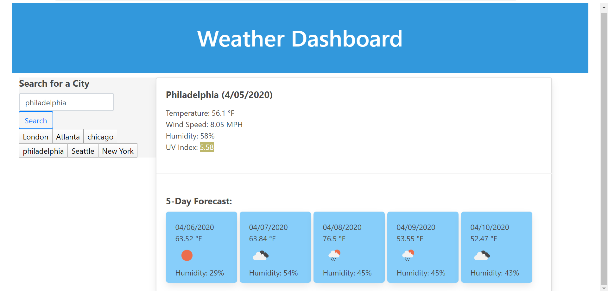

# Homework 6 - Weather Dashboard API App
The task is to build a weather dashboard that will run in the browser and feature dynamically updated HTML and CSS.

# How it is Made

This web application is made using html, custom css, moment js, bootstrap grids, bulma css framework, and dynamic javascript to render a web based weather dashboard that displays current weather data for a searched city along with a 5-day forecast for that specific city.  The weather data includes temperature, wind speed, humidity, UV Index, and weather icons in the 5day forecast. The application also stores previously searched cities to local storage and displays those cities on the web page and grants quick acessability to recall weather information if needed. The weather infomation is being collected by calling Open weather website by executing 3 different API calls including current weather API, UV Index API, and 5day forecast API.

# Web Application Components

A html file containing the basic skeleton was used along with custom css, moment js, and a separate javaScript file containing several API calls. Some boostrap and bulma framework components are used to style grids, buttons and other parts of the application.

# Screenshot


#Other details
git clone git@github.com/wayele/weatherAPI


```

## Technologies Used

* Html
* CSS/Bootstrap/Bulma
* JavaScript
* Moment JS
* Open Weather API

## Author

- Wub
